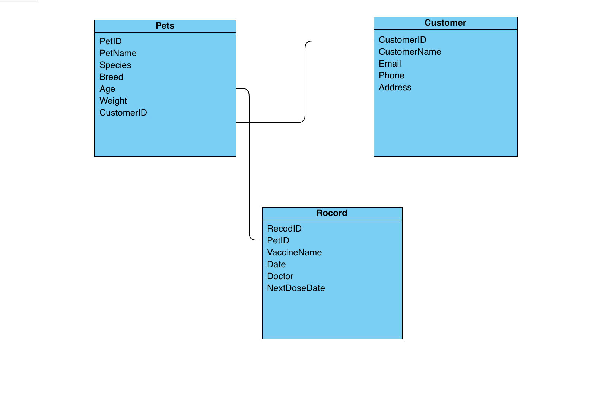
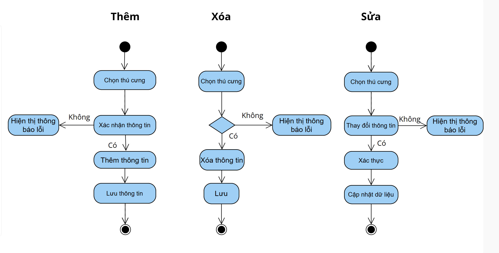

# Group 100 Project: Hệ thống quản lí cửa hàng thú cưng

# Member:

	1.Đào Thu Trang 

	2.Nguyễn Ngọc Minh

	3.Trần Thảo Vy

# Giới thiệu:

   Hệ thống quản lý cửa hàng thú cưng là một phần mềm hỗ trợ chủ cửa hàng trong việc theo dõi và điều hành hoạt động kinh doanh như: quản lý thú cưng, sản phẩm, đơn hàng, khách hàng và dịch vụ chăm sóc. Hệ thống giúp tối ưu hoá quy trình làm việc, tiết kiệm thời gian và nâng cao hiệu quả phục vụ khách hàng.

# Tính năng chính:

-	Giao diện Java Spring Boot.
  
-	Có chức năng quản lý Thú cưng
  
	+  Thêm, sửa, xóa Thú cưng (pets)
	+ Liệt kê thông tin về Thú cưng, có thể lọc ra các Thú cưng theo tên, loài, giống, tuổi, tình trạng sức khỏe…

-	Có chức năng quản lý Chủ nuôi (owner):
  
	+  Thêm, sửa, xóa Chủ nuôi (owner)
	+ Có chức năng gán Thú cưng (pets) cho Chủ nuôi (owner).

-	Có chức năng quản lý Hồ sơ (record):
  
	+ Thêm, sửa, xóa Hồ sơ (record)
	+ Liệt kê thông tin về Hồ sơ, có thể lọc Hồ sơ theo ngày khám, bác sĩ phụ trách

-	Dữ liệu được lưu trữ xuống file nhị phân.
  
	+ Cần tạo các lớp liên quan đến đối tượng Thú cưng (pets), đối tượng Chủ nuôi (owner), đối tượng Hồ sơ (record) để đọc, ghi xu ống 1 hay nhiều file.

-	Khi làm việc với dữ liệu trong bộ nhớ, dữ liệu cần được lưu trữ dưới dạng các Collection tùy chọn như ArrayList, LinkedList, Map,….

## Sơ đồ Class Diagram:

## Sơ đồ hành vi:

# Lưu đồ thuật toán:

# Phân chia công việc:
	Đào Thu Trang - 23010630 : Xây dựng logic cốt lõi của việc lọc và hiển thị lịch hẹn
		- Miêu tả phương thức:
			-Phương thức filterAppointmentsByDate trong AppointmentList sẽ lọc các lịch hẹn theo ngày.
			- Tương tác: Phương thức này thể hiện mối quan hệ sử dụng (uses-a):
				AppointmentList sử dụng các đối tượng Appointment để duyệt và lọc.
			- Khi hiển thị thông tin lịch hẹn, AppointmentList (hoặc một lớp hiển thị) sẽ tương tác với PetList bằng cách gọi phương thức getPetDetails(petId) để lấy thông tin chi tiết của thú cưng tương ứng với petId trong lịch hẹn. Điều này cho phép kết hợp thông tin từ hai lớp dữ liệu khác nhau.
	Trần Thảo Vy - 23010588 :Phát triển và hoàn thiện các lớp dữ liệu cần thiết.
		- Class Pet đại diện cho thông tin một thú cưng (ID, tên, loài, tên chủ sở hữu).
		- Class Appointment đại diện cho một lịch hẹn (ID lịch hẹn, ID thú cưng, ngày hẹn, lý do khám).
		- Tương tác: Mặc dù Pet và Appointment là các lớp riêng biệt, chúng tương tác thông qua petId. Appointment chứa petId như một "khóa ngoại" để chỉ ra lịch hẹn này thuộc về thú cưng nào. Lớp PetList sẽ "chứa" các đối tượng Pet, thể hiện mối quan hệ tổng hợp (composition).
	Nguyễn Ngọc Minh - 23010623: Kiểm thử tổng thể và tài liệu hóa.
		- Tương tác: Phương thức main() đóng vai trò là "điều phối viên", nó khởi tạo các đối tượng PetList và AppointmentList, sau đó gọi các phương thức của chúng để thực hiện các tác vụ (thêm dữ liệu, lấy ngày hiện tại, lọc lịch hẹn). Cuối cùng, nó kết hợp thông tin từ cả hai danh sách (PetList và AppointmentList) để hiển thị kết quả cuối cùng cho người dùng. Đây là điểm mà tất cả các đối tượng và chức năng nhỏ hợp tác (collaborate) để đạt được mục tiêu cuối cùng của ứng dụng.
# Công nghệ sử dụng:
    Ngôn ngữ: Java
