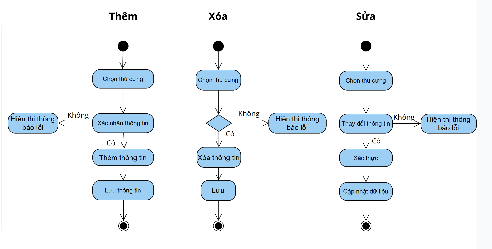
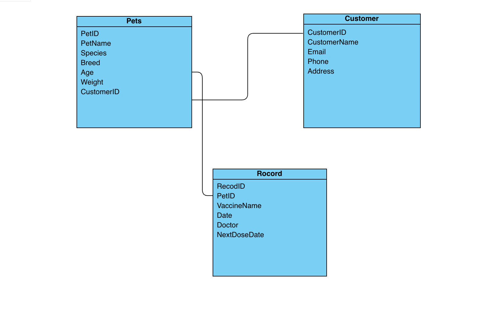

# Group 100 Project: Hệ thống quản lí thú cưng tại phòng khám thú y 

# Member:

	1.Đào Thu Trang 

	2.Nguyễn Ngọc Minh

	3.Trần Thảo Vy

	4.Nguyễn Lệ Thu

# Giới thiệu:
```
    Đây là hệ thống phần mềm giúp quản lý thông tin thú cưng, chủ nuôi, hồ sơ khám bệnh và các hoạt động liên quan tại trạm thú y. 
    Hệ thống hỗ trợ nhân viên thú y theo dõi lịch sử khám chữa bệnh, tiêm ngừa và tình trạng sức khỏe của thú cưng một cách dễ dàng và hiệu quả.
```

# Tính năng chính:

-	Giao diện Java Spring Boot.
  
-	Có chức năng quản lý Thú cưng
  
	+  Thêm, sửa, xóa Thú cưng (pets)
	+ Liệt kê thông tin về Thú cưng, có thể lọc ra các Thú cưng theo tên, loài, giống, tuổi, tình trạng sức khỏe…

-	Có chức năng quản lý Chủ nuôi (owner):
  
	+  Thêm, sửa, xóa Chủ nuôi (owner)
	+ Có chức năng gán Thú cưng (pets) cho Chủ nuôi (owner).

-	Có chức năng quản lý Hồ sơ (record):
  
	+ Thêm, sửa, xóa Hồ sơ (record)
	+ Liệt kê thông tin về Hồ sơ, có thể lọc Hồ sơ theo ngày khám, bác sĩ phụ trách

-	Dữ liệu được lưu trữ xuống file nhị phân.
  
	+ Cần tạo các lớp liên quan đến đối tượng Thú cưng (pets), đối tượng Chủ nuôi (owner), đối tượng Hồ sơ (record) để đọc, ghi xu ống 1 hay nhiều file.

-	Khi làm việc với dữ liệu trong bộ nhớ, dữ liệu cần được lưu trữ dưới dạng các Collection tùy chọn như ArrayList, LinkedList, Map,….

<<<<<<< HEAD
#Sơ đồ Class Diagram:

#Sơ đồ Behavioural Diagram:

=======

## Sơ đồ Class Diagram:

## Sơ đồ hành vi:

# Lưu đồ thuật toán:


# Phân chia công việc:
	Đào Thu Trang - 23010630 : Phát triển và hoàn thiện các lớp dữ liệu cần thiết.
	Trần Thảo Vy - 23010588 :Xây dựng logic cốt lõi của việc lọc và hiển thị lịch hẹn.
	Nguyễn Ngọc Minh - 23010623: Kiểm thử tổng thể và tài liệu hóa.
>>>>>>> refs/remotes/origin/main
# Công nghệ sử dụng:
    Ngôn ngữ: Java,
